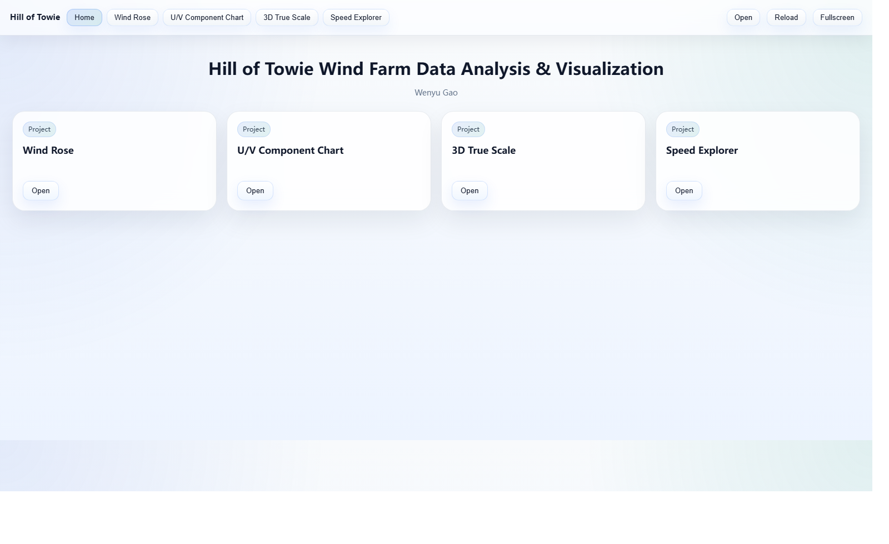
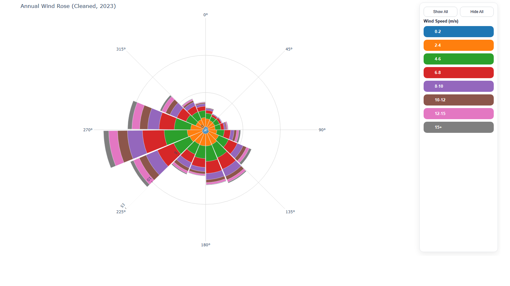
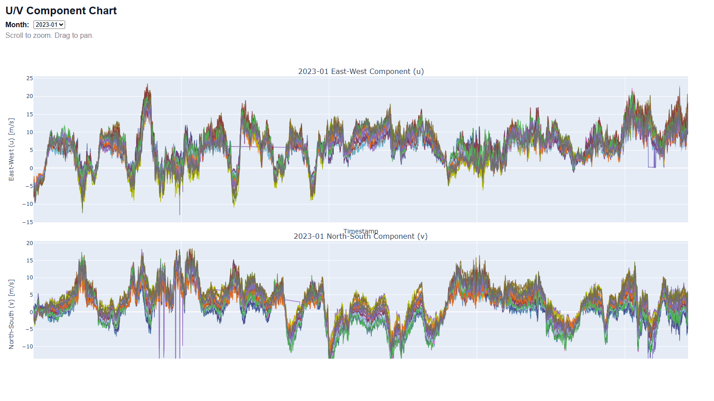
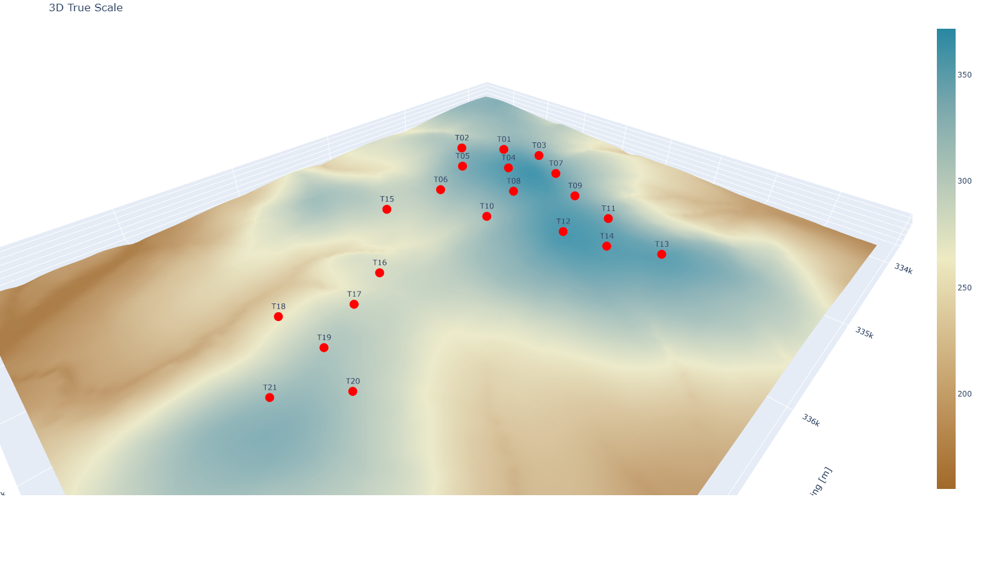
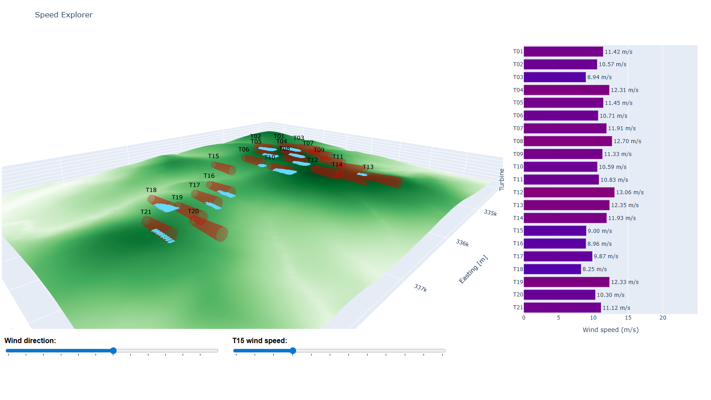

# Hill of Towie Wind Visualisation

An offline-first wind-farm visualisation project that turns SCADA measurements, turbine metadata, and terrain context into a compact multi-view presentation.

This lightweight repository is the portfolio version of the project: it keeps the cleaned source code, the active module outputs, and the pack builder, while staying inside normal GitHub file-size limits.

## Online Demo

- GitHub Pages homepage: [https://wenyugao1.github.io/hill-of-towie-wind-visualisation/](https://wenyugao1.github.io/hill-of-towie-wind-visualisation/)
- Direct module views:
  - [Wind Rose](https://wenyugao1.github.io/hill-of-towie-wind-visualisation/?view=annual_wind_rose_2023_interactive.html)
  - [U/V Component Chart](https://wenyugao1.github.io/hill-of-towie-wind-visualisation/?view=wind_uv_anomalies_2023_offline.html)
  - [3D True Scale](https://wenyugao1.github.io/hill-of-towie-wind-visualisation/?view=hill_of_towie_3d_true_scale.html)
  - [Speed Explorer](https://wenyugao1.github.io/hill-of-towie-wind-visualisation/?view=hill_of_towie_interactive_speed.html)

## Project Highlights

- Built four coordinated visualisation modules for wind-farm analysis
- Refactored a research-style prototype into a cleaner, reproducible codebase
- Packaged multiple HTML views into a single `Pack.html` workflow
- Preserved an offline presentation path while also preparing a GitHub-friendly lightweight version

## Standalone HTML Files In This Repo

- [Wind Rose](./github%20project_wind/annual_wind_rose_2023_interactive.html)
- [U/V Component Chart](./github%20project_wind/wind_uv_anomalies_2023_offline.html)
- [3D True Scale](./github%20project_wind/hill_of_towie_3d_true_scale.html)
- [Speed Explorer](./github%20project_wind/hill_of_towie_interactive_speed.html)

## Unified Pack Overview

The public lightweight repository keeps the modular HTML demos, while the full local workflow can still be bundled into a single Pack interface like this:

<p align="center">
  
</p>

## Screenshots

<table>
<tr>
<td width="50%" align="center"><strong>Wind Rose</strong><br></td>
<td width="50%" align="center"><strong>U/V Component Chart</strong><br></td>
</tr>
<tr>
<td width="50%" align="center"><strong>3D True Scale</strong><br></td>
<td width="50%" align="center"><strong>Speed Explorer</strong><br></td>
</tr>
</table>


## Active Modules

### 1. Wind Rose

This module consolidates the cleaned 2023 SCADA files into a single annual wind-resource view, binning wind direction into 16 sectors and stacking the frequency of multiple wind-speed bands in each sector. The generated HTML adds an interactive side panel for toggling speed layers on and off, making it easy to separate the dominant directional pattern from the contribution of stronger wind regimes. As a front-door view, it gives a compact summary of the site's prevailing wind structure before moving into turbine-level or terrain-aware analysis.

### 2. U/V Component Chart

This module transforms measured wind speed and direction into east-west (`u`) and north-south (`v`) vector components, then rebuilds the year as monthly dual-panel time-series views with all turbines shown on shared axes. In code, the pipeline reads the cleaned SCADA tables, computes the vector decomposition, groups the data by month, and packages each month into a single Plotly figure that is redrawn into one stable container when the user switches months. That matters because it turns what used to be an anomaly-report-style page into a cleaner diagnostic tool for directional wind behaviour: instead of only seeing magnitude, you can compare how different turbines respond to the same atmospheric shifts along two physically meaningful axes.

### 3. 3D True Scale

This module projects turbine metadata into British National Grid coordinates, crops the DEM to the actual wind-farm neighbourhood, interpolates ground elevation at each turbine location, and places the turbine hubs back onto the terrain at true spatial positions. The resulting view is not a schematic layout but a terrain-aligned spatial model, so relative elevation, turbine spacing, and ridge or slope placement remain visually meaningful. It serves as the geometric baseline for understanding how the site is arranged in real ground coordinates.

### 4. Speed Explorer

This is the most interaction-heavy module in the repository: it combines SCADA aggregation, terrain rendering, turbine geometry, and linked controls into one exploratory 3D view. The generator precomputes turbine-level mean wind speeds on a grid of wind-direction bins and `T15` speed conditions, loads and crops the DEM, extracts a reusable turbine 3D model, instantiates wake cones across the site, and keeps the 3D scene synchronized with a turbine-by-turbine bar chart on the right. The result is a terrain-aware exploration tool where the reader can change wind direction and reference wind speed, then immediately inspect how the whole farm's speed distribution and wake footprint shift under different operating conditions; the sample-count check is an extra detail that makes the interaction more defensible rather than purely decorative.

## Tech Stack

- Python
- Pandas and NumPy
- Plotly
- Rasterio and PyProj
- Trimesh

## Repository Layout

```text
github_light/
|-- .nojekyll
|-- assets/
|   `-- screenshots/
|       |-- pack-overview.png
|       |-- wind-rose.png
|       |-- uv-component-chart.png
|       |-- true-scale.png
|       `-- speed-explorer.png
|-- module_generators/
|   |-- build_wind_rose.py
|   |-- build_uv_component_chart.py
|   |-- build_true_scale.py
|   |-- build_speed_explorer.py
|   `-- common_paths.py
|-- github project_wind/
|   |-- annual_wind_rose_2023_interactive.html
|   |-- wind_uv_anomalies_2023_offline.html
|   |-- hill_of_towie_3d_true_scale.html
|   `-- hill_of_towie_interactive_speed.html
|-- main.py
|-- build_full_pack.py
|-- index.html
|-- requirements.txt
`-- README.md
```

## What This Lightweight Version Includes

- The active source code for the four module generators
- The current standalone module HTML outputs
- A GitHub Pages-ready root entry in `index.html`
- The pack builder in `main.py`
- A structure suitable for a normal GitHub repository without Git LFS

## Public Repository Scope

This public portfolio repository keeps the parts that are most useful for review:
the active module-generator source code, the standalone HTML demos, and the GitHub Pages entry used for online viewing.
The large dissertation-era raw datasets are intentionally not included in this lightweight public copy.

With this lightweight version you can:

- Read the cleaned source code for the four active modules
- Open the included module HTML files directly
- Run `python main.py` to rebuild a local `Pack.html` from the included module HTML files

## Install

```powershell
pip install -r requirements.txt
```

## Rebuild The Pack From Included Module HTML Files

```powershell
python main.py
```

The rebuilt `Pack.html` in this lightweight version depends on the Plotly CDN because the included demo HTML files are the lightweight web-friendly variants.

## Portfolio Framing

This repository is intended to demonstrate:

- applied data visualisation work
- offline HTML packaging
- technical refactoring of a messy prototype
- careful trimming of a large local project into a clean public-facing portfolio repository
